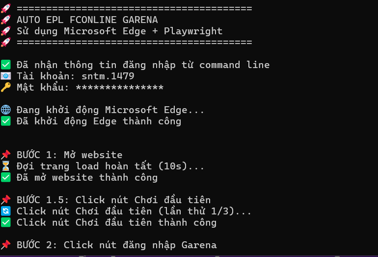
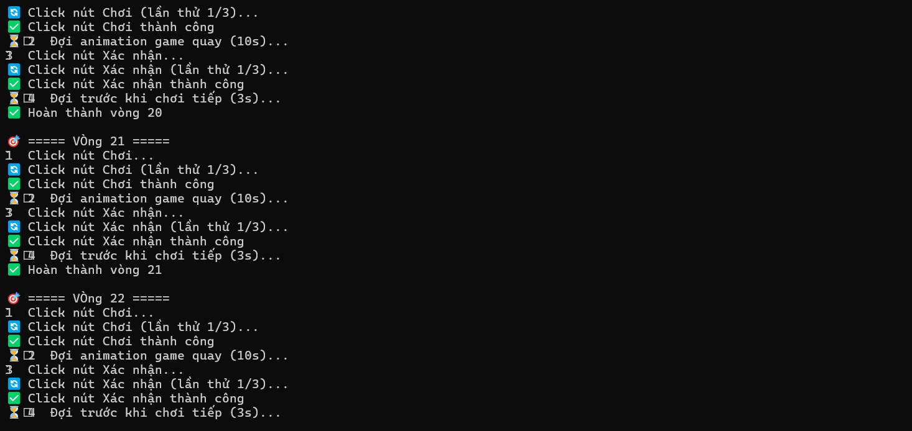

# 🎮 Auto EPL FOnline Garena

**Công cụ tự động chơi game EPL FOnline Garena**

[](https://nodejs.org/)
[](https://playwright.dev/)

---

## ⚠️ Lưu ý quan trọng

> **BẢO MẬT:**
> - Chỉ chạy local trên máy tính của bạn
> - KHÔNG gửi dữ liệu ra bên ngoài
> - KHÔNG lưu tài khoản/mật khẩu
> - KHÔNG có telemetry/analytics/tracking
> 
> **TRÁCH NHIỆM:**
> - Sử dụng có trách nhiệm và tuân thủ điều khoản dịch vụ của game
> - Tự chịu trách nhiệm về mọi hậu quả phát sinh

---

## ✨ Tính năng

✅ Tự động đăng nhập với tài khoản/mật khẩu  
✅ Auto play - Tự động click "Chơi" và xác nhận phần thưởng  
✅ Vòng lặp liên tục không giới hạn  
✅ Retry thông minh với exponential backoff  
✅ Tự động khôi phục khi browser crash  
✅ Headless mode - Chạy ngầm không hiển thị browser  
✅ Logging chi tiết theo dõi từng bước  

---

## 💻 Yêu cầu hệ thống

- **OS:** Windows 10/11 (64-bit)
- **Node.js:** >= 16.0.0 ([Download](https://nodejs.org/))
- **Microsoft Edge:** Chromium-based Edge (đã cài sẵn trên Windows 10/11)
- **RAM:** Tối thiểu 4GB (khuyến nghị 8GB)

Kiểm tra Node.js:
```bash
node --version
# Phải hiển thị v16.x.x hoặc cao hơn
```

---

## 📦 Cài đặt

**Bước 1:** Clone hoặc download project

```bash
# Nếu có git
git clone https://github.com/lethang11022005/Auto_FPL_FCOnline.git
cd auto_fpl_fco

# Hoặc download ZIP và giải nén
```

**Bước 2:** Cài đặt dependencies

```bash
npm install
```

**Bước 3:** Cài đặt Microsoft Edge browser

```bash
npm run install-browser
```

Hoặc:

```bash
npx playwright install msedge
```

**Bước 4:** Hoàn tất! Kiểm tra cài đặt

```bash
npm start
```

Nếu thấy thông báo yêu cầu nhập tài khoản/mật khẩu → Cài đặt thành công!


---

## 🚀 Sử dụng

### Chạy chương trình

**Cách 1: Dùng npm**

```bash
npm start <tài_khoản> <mật_khẩu>
```

**Cách 2: Dùng node trực tiếp**

```bash
node src/index.js <tài_khoản> <mật_khẩu>
```

**Ví dụ:**

```bash
npm start myusername mypassword
```


> **Lưu ý:** Tài khoản và mật khẩu là BẮT BUỘC. Chương trình sẽ tự động đăng nhập và bắt đầu chơi.



---

### Dừng chương trình

Nhấn `Ctrl + C` trong terminal để dừng chương trình một cách an toàn.

Chương trình sẽ tự động:
- ✅ Cleanup resources
- ✅ Đóng browser
- ✅ Giải phóng memory

---

## ⚙️ Cấu hình

### Chỉnh sửa timing và behavior

Chỉnh sửa file `src/config/constants.js`:

```javascript
TIMING: {
    PAGE_LOAD: 10000,        // Thời gian đợi trang load (ms)
    ANIMATION: 10000,        // Thời gian đợi animation game (ms)
    AFTER_CONFIRM: 3000,     // Thời gian đợi sau khi xác nhận (ms)
    // ...
}
```

### Chế độ headless

Mặc định chương trình chạy ở chế độ headless (không hiện browser).

Để hiện browser, chỉnh sửa `src/config/constants.js`:

```javascript
BROWSER: {
    HEADLESS: false,  // Đổi thành false
    // ...
}
```

### Chỉnh sửa selectors

Nếu website thay đổi cấu trúc, cập nhật selectors trong `src/config/constants.js`:

```javascript
SELECTORS: {
    PLAY_BUTTON: '.spin__play a.btn--red-big',
    LOGIN_LINK: 'a[href="/user/login"]',
    // ...
}
```

---

## 📁 Cấu trúc dự án

```
auto_fpl_fco/
├── src/                          # Source code
│   ├── config/                   # Configuration
│   │   ├── constants.js          # Hằng số (URL, selectors, timing)
│   │   └── config.js             # Config loader
│   ├── utils/                    # Utilities
│   │   ├── logger.js             # Logging system
│   │   └── helpers.js            # Helper functions
│   ├── handlers/                 # Business logic
│   │   ├── browserHandler.js    # Browser management
│   │   └── gameHandler.js        # Game logic
│   └── index.js                  # Entry point
├── img/                          # Screenshots
├── package.json                  # NPM configuration
├── .gitignore                    # Git ignore rules
└── README.md                     # Documentation
```

---

## ❓ FAQ

**1. Chương trình có an toàn không?**

Có. Chương trình chỉ chạy local, không gửi dữ liệu ra ngoài, không lưu credentials. Open source, có thể review code.

**2. Tài khoản có bị ban không?**

Sử dụng automation tool luôn có rủi ro. Sử dụng có trách nhiệm và tuân thủ điều khoản dịch vụ của game.

**3. Chương trình có chạy trên Mac/Linux không?**

Không. Hiện tại chỉ hỗ trợ Windows 10/11.

**4. Tôi có thể chạy nhiều instance cùng lúc không?**

Có. Mở nhiều terminal và chạy với tài khoản khác nhau.

**5. Chương trình có tốn nhiều RAM không?**

Không. Mỗi instance tiêu thụ khoảng 200-300MB RAM.

---

## 🔧 Troubleshooting

Gặp lỗi? Xem hướng dẫn chi tiết tại [ERRORS.md](ERRORS.md)

### Lỗi thường gặp

**Lỗi: "Executable doesn't exist"**

Chưa cài đặt Microsoft Edge browser:
```bash
npm run install-browser
```

**Lỗi: "Cannot find module"**

Chưa cài đặt dependencies:
```bash
npm install
```

**Lỗi: "Timeout waiting for selector"**

Website load chậm hoặc selector đã thay đổi. Tăng timeout trong `src/config/constants.js` hoặc kiểm tra kết nối internet.

---

## 📄 License

MIT License

---

## ⚠️ Disclaimer

Công cụ này được tạo ra chỉ cho mục đích học tập và nghiên cứu. Người dùng tự chịu trách nhiệm khi sử dụng. Tác giả không chịu trách nhiệm về bất kỳ hậu quả nào phát sinh.

**Sử dụng có trách nhiệm và tuân thủ điều khoản dịch vụ của game.**
